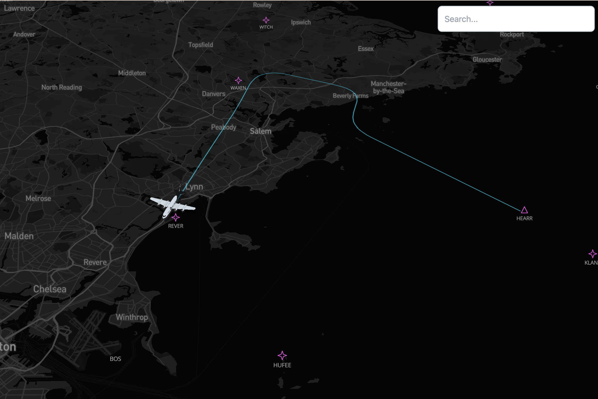

# Integrating Mapbox Search with Custom Data

Demo application for the BUILD with Mapbox talk **"Integrating Mapbox Search with custom data."** It shows how to layer your own custom datasets into [Mapbox Search JS](https://docs.mapbox.com/mapbox-search-js/) — in this case, 19K US based airports, aviation waypoints and live flight tracking — rather than only searching Mapbox's default POI data.

## Overview

Built with [Mapbox GL JS](https://docs.mapbox.com/mapbox-gl-js/) and React + TypeScript, this app progresses through a series of patterns (tagged in git history as `pattern1` → `pattern3`) demonstrating:

- Wiring Mapbox SearchBox to query custom/local data alongside Mapbox Search results
- Rendering custom waypoint data as a custom tileset and making that tileset data searchable
- Adding a live flight trace and 3D plane model sourced from ADS-B data

This application has been scaffolded by the [create @mapbox/web-app](https://www.npmjs.com/package/@mapbox/create-web-app) CLI tool.

## Prerequisites

- Node v18.20 or higher
- npm

## How to run

Create a new `.env` file based on the included `.env.sample` file and add your Mapbox Access Token.

Run the project with `npm run dev` in this project directory.

## Related resources

- [Add SearchBox to your React App](https://docs.mapbox.com/mapbox-search-js/api/react/search/)
- [Add custom data to Mapbox Search - Tutorial](https://docs.mapbox.com/help/tutorials/custom-data-with-search-js/)
- [Using customSearch parameter in Mapbox SearchBox - Example](https://docs.mapbox.com/mapbox-search-js/example/custom-search-react/)

